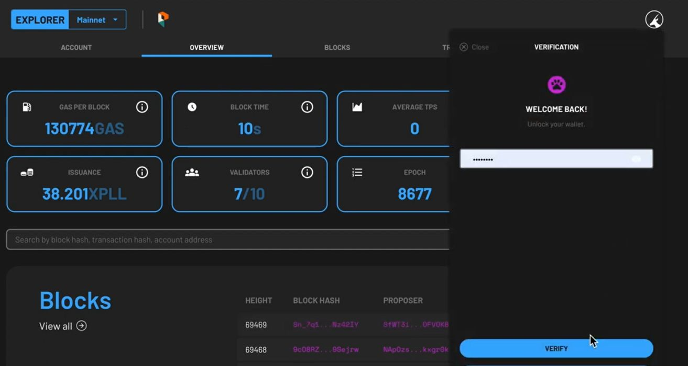

---
tags:
- Xperience
- explorer
- lockup contract
---

Your XPLL allocation might be subject to a vesting schedule that determines how many of your tokens are vested (unlocked) as time goes on. In order to **claim** the unlocked portion in the future, you need to first ***register** the Lock-up Contract* of your allocation to your account. 

!!! Note    
    Each Lock-up Contract is unique to each holder. 
    
Follow the steps below to register your Lock-up Contract to your ParallelChain wallet account. You can also watch the video tutorial [here](https://www.youtube.com/watch?v=ZxojrGycSmQ).

## Logging in Your Wallet
{ width=80%  style="display: block; margin: 0 auto" } 

1. Access the [ParallelChain Explorer](https://explorer.parallelchain.io), or click on the **EXPLORER** button on the [ParallelChain homepage](https://parallelchain.io/).
2. To log in, click on the round icon on the top right hand corner of the explorer page and enter your password.
3. Press the **LOGIN** button.
4. If you do not remember your password, you can choose to log in with your recovery key. Once you have access to your account, you should set a new password through your wallet settings.
5. Once you are verified, you can access your wallet account.

## Registering Your Lock-Up Contract

### Step 1: Get Your Lock-Up Contract Address 
1. Your lock-up contract address would have been sent to you **via email**. Check your email and copy your lock-up contract address.

### Step 2: Register Your Lock-Up Contract
{ width=80%  style="display: block; margin: 0 auto" } 

1. Click the *pink icon* located on the right side of the **STAKE** button.
2. You will be asked to enter your Lock-up Contract address that has been sent to you via email. To proceed, paste the address in the **INPUT CONTRACT ADDRESS** field, then click **Register**.
3. The balance of locked tokens is displayed under the **LOCKED** field, whereas the amount of vested tokens is shown under the **UNLOCKED** field. You will have to manually claim the vested tokens to have them transferred to your normal account.
4. Your account comes with a small amount of XPLL to pay for the gas fee for the first transaction.

    { width=80%  style="display: block; margin: 0 auto" } 

5. Click the **CONFIRM** button to confirm.

!!! Note
    For **Node Round participants** who will operate validator nodes on ParallelChain, the *locked balance* shown will be **0** as your allocation has been automatically staked on one of the existing validator nodes.

Watch the video tutorial to register your locked-up contract [here](https://youtu.be/ZxojrGycSmQ).

## Claiming Your Vested Tokens

### Step 1: Check Your Vested Balance
{ width=80%  style="display: block; margin: 0 auto" } 

1. Click the *pink* icon located on the right side of the **STAKE** button.

2. On the main display of your account, make sure that you can view your **Lock-up Contract (XPLL)** which is shown beside your main balance.

3. Tap on the **Lock-up Contract (XPLL)** window. It will expand to display different fields.

    - **LOCKED** - the tokens that currently cannot be claimed.
    - **UNLOCKED** - the tokens that currently can be claimed.
    - **CURRENT PHASE** - the vesting phase it is in at the moment.
    - **NEXT PHASE** - the amount of time left before your tokens are vested

4. Under tte **UNLOCKED** field, you can see the amount of tokens that is currently available to claim (unlock).

### Step 2: Claim Your Vested Tokens
{ width=80%  style="display: block; margin: 0 auto" } 

1. Under the **UNLOCKED** field, press the **CLAIM** button to initiate your token claim.

2. You will see two fields, the **BALANCE** field and **CLAIM** field. The first shows the current amount of tokens in your account balance, and the other field lets you enter the amount of tokens you wish to claim.

3. Under the **CLAIM** field, enter the amount of XPLL you wish to claim. This number cannot exceed the amount in the **UNLOCKED** field.

4. Press the **NEXT** button at the bottom once you are satisfied with the amount entered.

5. The following fields will appear:

    - **Nonce** - will be automatically populated for you.
    - **Max Base Fee per Gas** - The minimum fee is 8 XPLL, and this field will be automatically populated for you.
    - **Priority Fee per Gas** - the priority of your transaction. The minimum fee is 0.
    - **Gas Limit** - will be automatically populated for you.

    { width=80%  style="display: block; margin: 0 auto" } 

6. Once you are satisfied with the populated fields, press **NEXT** at the bottom.

7. Preview the summary of the transaction, then press **CONFIRM** to continue, or **CANCEL** to make edits.

8. The status of the token deposit will be shown as **PENDING**. When it is validated by the network, a **SUCCESS** will be shown under its status tab.

9. The claimed tokens have now successfully been transferred to your account balance.

Watch the video tutorial to claim your vested tokens [here](https://youtu.be/ZxojrGycSmQ).

## FAQ

### Do I need to wait for the full vesting period before being able to claim the locked XPLL?

A set amount of XPLL will be unlocked after a set period of time, and will be displayed in the **UNLOCKED** field. You may choose to claim after the end of each duration, although gas fees will have to be paid each time. You can also choose to accumulate the unlocked XPLL and claim them later in one transaction.