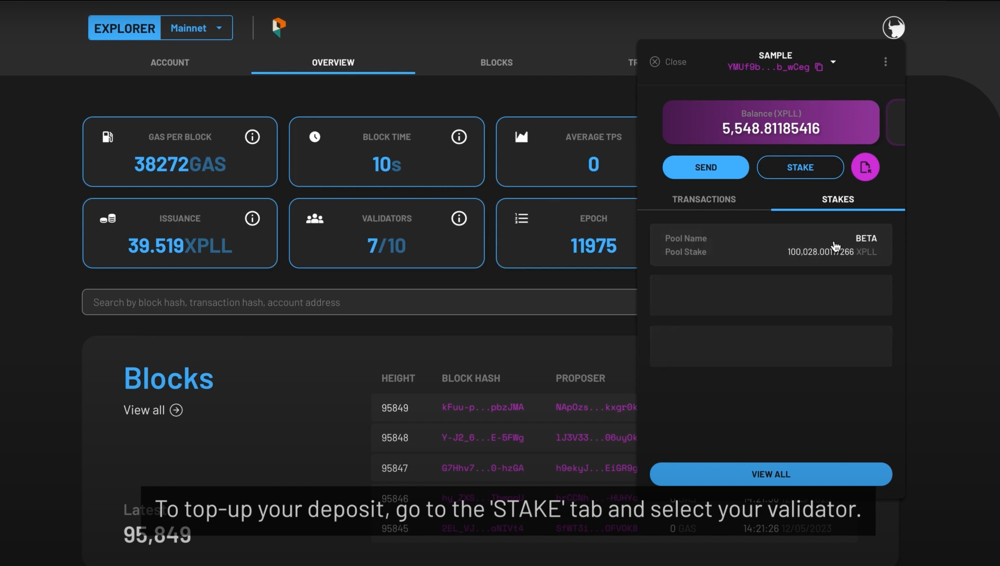
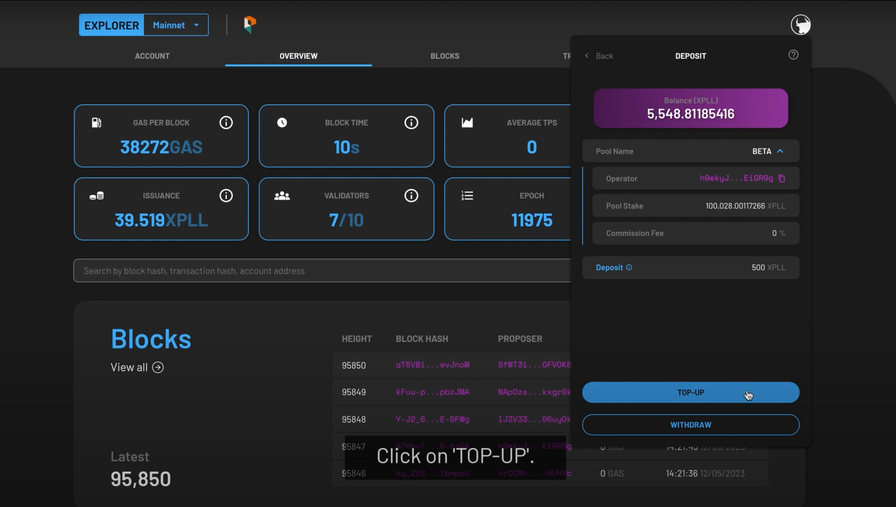

---
tags:
- Xperience
- explorer
- staking
---

You can stake XPLL with network validators to help secure the blockchain and earn rewards in the meantime. Follow the steps below to stake XPLL tokens with your ParallelChain account. You can also watch the video tutorial [here](https://youtu.be/aEa1T-sopmA).

## Logging in Your Wallet

{ width=90%  style="display: block; margin: 0 auto" } 

1. Access the [ParallelChain Explorer](https://explorer.parallelchain.io), or click on the **EXPLORER** button on the [ParallelChain homepage](https://parallelchain.io/).
2. To log in, click on the round icon on the top right hand corner of the explorer page and enter your password.
3. Press the **LOGIN** button.
4. If you do not remember your password, you can choose to log in with your recovery key. Once you have access to your account, you should set a new password through your wallet settings.
5. Once you are verified, you can access your wallet account.

## Depositing Your XPLL

### Step 1: Select a validator
{ width=90%  style="display: block; margin: 0 auto" }

1. Click the **STAKE** button which is located beside the **SEND** button.
2. You will see the list of validator pools you can stake in.
3. Choose from the list, or search for a specific validator via the search bar at the top labelled **SEARCH OPERATOR ADDRESS**.

### Step 2: Deposit XPLL

#### Through Your Account
{ width=90%  style="display: block; margin: 0 auto" }

1. Once you have selected your desired validator, the details of the validator pool will be displayed.

2. Selecting the drop-down arrow under the **POOL NAME** field reveals the **OPERATOR** field, **POOL STAKE** field, and **COMMISSION FEE** field.
    - **OPERATOR** - the validator's address is displayed here.
    - **POOL STAKE** - the amount of XPLL staked with the validator is displayed here.
    - **COMMISSION FEE** - the number displayed is the percentage of your rewards the validator will take as a commission fee.

3. To deposit your XPLL with the validator, enter the desired amount in the **DEPOSIT** field.
4. If you would like to auto-stake your rewards, toggle the **AUTO STAKE REWARDS** field on.

#### Through Your Lock-Up Contract
1. Once you have selected your desired validator, the details of the validator pool will be displayed.

    - **LOCK-UP CONTRACT (XPLL)** field and **LOCKED** field, your tokens that are still vested are shown here.
    - Selecting the drop-down arrow under the **POOL NAME** field reveals the **OPERATOR** field, **POOL STAKE** field, and **COMMISSION FEE** field.
    - **OPERATOR** field, the validator**s address is displayed here.
    - **COMMISSION FEE** field, the number displayed is the percentage of your rewards the validator will take as a commission fee.
    - **COMMISSION FEE** field, the number displayed is the percentage of your rewards the validator will take as a commission fee.

2. When you deposit your XPLL with the lock-up contract, the amount is automatically filled for you in the **DEPOSIT** field.
3. If you would like to auto-stake your rewards, toggle the **AUTO STAKE REWARDS** field on.

### Step 3: Confirm Your Transaction
{ width=90%  style="display: block; margin: 0 auto" }

1. The following fields will appear:
    - **Nonce** - This field will be automatically populated for you.
    - **Max Base Fee per Gas** - This field will be automatically populated for you based on the current Base Fee per Gas of the network.
    - **Priority Fee per Gas** - This determines the priority of your transaction, and the minimum fee is 0 XPLL.
    - **Gas Limit** - This field will be automatically populated for you.

2. Once you are satisfied with the populated fields, press **NEXT** at the bottom.
3. Preview the summary of the transaction, then press **CONFIRM** to continue, or **CANCEL** to make edits
4. The status of the token deposit will be shown as **PENDING**. When it is validated by the network, a **SUCCESS** will be shown under its status tab.
5. Your XPLL has now been successfully deposited with the validator. You can create more than one deposit by repeating the process under different validators.
6. To start earning XPLL from staking, follow the instructions under [Stake Your XPLL](#staking-your-xpll) below.

Watch the video tutorial to learn how to deposit XPLL to the staking wallet [here](https://youtu.be/aEa1T-sopmA).

## Staking Your XPLL

You can stake XPLL which you have deposited with validators to earn rewards.

### Step 1: Navigate To Your Chosen Validator
{ width=90%  style="display: block; margin: 0 auto" }

1. On the main page, select the **STAKES** tab which is located beside the **TRANSACTIONS** tab. Then select the pool which you wish to top up XPLL.
2. The pool information will be shown, along with fields relevant to you. This includes:
    - **DEPOSIT** - the amount of XPLL you have deposited with the validator.
    - **TENTATIVE STAKE** - the balance you have in the pool at this moment which will become part of the current stake in the future.
    - **CURRENT STAKE** - the balance in the pool which has become part of the current validator set, and is now earning rewards.
    - If you would like to auto-stake your rewards, toggle the **AUTO STAKE REWARDS** field on.

    { width=90%  style="display: block; margin: 0 auto" }

3. To stake XPLL, tap on the arrow beside the **TENTATIVE STAKE** field.

### Step 2: Stake XPLL

#### From Your Account
{ width=90%  style="display: block; margin: 0 auto" }

1. The details of the validator pool will be displayed as shown:

    - Selecting the drop-down arrow under the **POOL NAME**:
        - **OPERATOR** - the validator's address.
        - **POOL STAKE** - the amount of XPLL staked with the validator.
        - **COMMISSION FEE** - the percentage of your rewards the validator will take as a commission fee.

    - Your deposited XPLL will be shown in the **DEPOSIT** field.

2. Create your initial stake with the validator by entering the amount of XPLL you wish to stake in the **STAKE MAX** field. The number cannot exceed the amount of XPLL you have deposited.
3. If you have an existing stake with the validator, you have the option to stake more XPLL or unstake them with the **STAKE** and **UNSTAKE** buttons respectively.
4. To add more staked XPLL, select the **STAKE** button. Enter the amount of XPLL you wish to stake in the **STAKE MAX** field. The number cannot exceed the amount of XPLL you have deposited.
5. Press **NEXT** once you are comfortable with the amount.

#### From Your Lock-Up Contract
1. The details of the validator pool will be displayed as shown:

    - **LOCK-UP CONTRACT (XPLL)**/**LOCKED** - your tokens that are still vested.
    - Selecting the drop-down arrow under the **POOL NAME**:
        - **OPERATOR** - the validator's address.
        - **POOL STAKE** - the amount of XPLL staked with the validator.
        - **COMMISSION FEE** - the percentage of your rewards the validator will take as a commission fee.

    - Your deposited XPLL will be shown in the **DEPOSIT** field.

2. Create your initial stake with the validator. The amount is automatically filled for you in the **STAKE MAX** field.
3. If you have an existing stake with the validator, you have the option to stake more XPLL or unstake them with the **STAKE** and **UNSTAKE** buttons respectively.
4. To add more staked XPLL, select the **STAKE** button. If you are staking with the validator through a lock-up contract, the amount is automatically filled for you in the **STAKE MAX** field.
5. Press **NEXT** to continue.

### Step 3: Confirm Your Transaction
{ width=90%  style="display: block; margin: 0 auto" }

1. The following fields will appear:
    - **Nonce** - This field will be automatically populated for you.
    - **Max Base Fee per Gas**- This field will be automatically populated for you based on the current Base Fee per Gas of the network.
    - **Priority Fee per Gas**- This determines the priority of your transaction, and the minimum fee is 0 XPLL.
    - **Gas Limit**- This field will be automatically populated for you.

2. Once you are satisfied with the populated fields, press **NEXT** at the bottom.
3. Preview the summary of the transaction, then press **CONFIRM** to continue, or **CANCEL** to make edits.
4. The status of the token deposit will be shown as **PENDING**. When it is validated by the network, a **SUCCESS** will be shown under its status tab. 

!!! Note
    Due to the network state when your transaction gets included, the actual amount may differ slightly from your desired amount.

Watch the video tutorial on how to stake your XPLL [here](https://youtu.be/aEa1T-sopmA).

## Topping Up Your Stake

### Step 1: Navigate To Your Chosen Validator
{ width=90%  style="display: block; margin: 0 auto" }

1. On the main page, select the **STAKES** tab which is located beside the **TRANSACTIONS** tab. Then select the pool which you wish to top up XPLL.
2. The pool information will be shown, along with fields relevant to you. This includes:

    - **DEPOSIT** - the amount of XPLL you have deposited with the validator.
    - **TENTATIVE STAKE** - the balance you have in the pool at this moment which will become part of the current stake in the future.
    - **CURRENT STAKE** - the balance in the pool which has become part of the current validator set, and is now earning rewards.
    - If you would like to auto-stake your rewards, toggle the **AUTO STAKE REWARDS** field on.

    { width=90%  style="display: block; margin: 0 auto" }
3. To top up XPLL, tap on the arrow beside the **DEPOSIT** field

### Step 2: Top-up Your Stake Through Your Account
1. Once you have selected your desired validator, the details of the validator pool will be displayed as shown:

    - Selecting the drop-down arrow under the **POOL NAME**:
        - **OPERATOR** - the validator's address.
        - **POOL STAKE** - the amount of XPLL staked with the validator.
        - **COMMISSION FEE** - the percentage of your rewards the validator will take as a commission fee.

    - Your deposited XPLL will be shown in the **DEPOSIT** field.

    { width=90%  style="display: block; margin: 0 auto" }

2. Select **TOP-UP** to deposit more XPLL to your validator deposit.
3. The **TOP-UP** field will appear, and you can enter the amount you wish to top-up. The amount cannot exceed your account balance.
4. Click **NEXT** to continue.

### Step 3: Confirm Your Transaction
{ width=90%  style="display: block; margin: 0 auto" }

1. The following fields will appear:

    - **Nonce** - This field will be automatically populated for you.
    - **Max Base Fee per Gas**- This field will be automatically populated for you based on the current Base Fee per Gas of the network.
    - **Priority Fee per Gas**- This determines the priority of your transaction, and the minimum fee is 0 XPLL.
    - **Gas Limit**- This field will be automatically populated for you.

2. Once you are satisfied with the populated fields, press **NEXT** at the bottom.
3. Preview the summary of the transaction, then press **CONFIRM** to continue, or **CANCEL** to make edits.
4. The status of the token deposit top up will be shown as **PENDING**. When it is validated by the network, a **SUCCESS** will be shown under its status tab.

Watch the video tutorial on how to top up your XPLL [here](https://youtu.be/aEa1T-sopmA).

## Withdrawing Your Stakes

### Step 1: Navigate To Your Chosen Validator
{ width=90%  style="display: block; margin: 0 auto"}

1. On the main page, select the **STAKES** tab which is located beside the **TRANSACTIONS** tab. Then select the pool which you wish to withdraw XPLL.
2. The pool information will be shown, along with fields relevant to you. This includes:

    - **DEPOSIT** - the amount of XPLL you have deposited with the validator.
    - **TENTATIVE STAKE** - the balance you have in the pool at this moment which will become part of the current stake in the future.
    - **CURRENT STAKE** - the balance in the pool which has become part of the current validator set, and is now earning rewards.
    - If you would like to auto-stake your rewards, toggle the **AUTO STAKE REWARDS** field on.

    { width=90%  style="display: block; margin: 0 auto"} 

3. To withdraw XPLL, tap on the arrow beside the **DEPOSIT** field.

### Step 2: Withdraw Stakes

#### To Your Account

1. The details of the validator pool will be displayed as shown:

    - Selecting the drop-down arrow under the **POOL NAME**:
        - **OPERATOR** - the validator's address.
        - **POOL STAKE** - the amount of XPLL staked with the validator.
        - **COMMISSION FEE** - the percentage of your rewards the validator will take as a commission fee.

    - Your deposited XPLL will be shown in the **DEPOSIT** field.

    { width=90%  style="display: block; margin: 0 auto" }

2. Select **WITHDRAW** to withdraw XPLL from your validator deposit.
3. The **WITHDRAW MAX** field will appear, and you can enter the amount you wish to withdraw. The amount cannot exceed the current amount deposited with the validator.

#### To Your Lock-Up Contract
1. The details of the validator pool will be displayed as shown:

    - **LOCK-UP CONTRACT (XPLL)**/**LOCKED** - your tokens that are still vested.
    - Selecting the drop-down arrow under the **POOL NAME**:
        - **OPERATOR** - the validator's address.
        - **POOL STAKE** - the amount of XPLL staked with the validator.
        - **COMMISSION FEE** - the percentage of your rewards the validator will take as a commission fee.

    - Your deposited XPLL will be shown in the **DEPOSIT** field.

2. Select **WITHDRAW** to withdraw XPLL from your validator deposit.
3. If you are withdrawing from the validator to a lock-up contract, the amount is automatically filled for you in the **WITHDRAW MAX** field. According to the period when you withdraw your XPLL, the withdrawal may be split between your lock-up contract's *locked* and *unlocked* tokens.
4. Press **NEXT** to continue

### Step 3: Confirm Your Transaction
{ width=90%  style="display: block; margin: 0 auto" }

1. The following fields will appear:

    - **Nonce** - This field will be automatically populated for you.
    - **Max Base Fee per Gas**- This field will be automatically populated for you based on the current Base Fee per Gas of the network.
    - **Priority Fee per Gas**- This determines the priority of your transaction, and the minimum fee is 0 XPLL.
    - **Gas Limit**- This field will be automatically populated for you.

2. Once you are satisfied with the populated fields, press **NEXT** at the bottom
3. Preview the summary of the transaction, then press **CONFIRM** to continue, or **CANCEL** to make edits
4. The status of the token withdrawal will be shown as **PENDING**. When it is validated by the network, a **SUCCESS** will be shown under its status tab. 

!!! Note
    Due to the network state when your transaction gets included, the actual amount may differ slightly from your desired amount.

Watch the video tutorial to withdraw your XPLL [here](https://youtu.be/aEa1T-sopmA).

## Unstaking Your XPLL

### Step 1: Navigate To Your Chosen Validator

{ width=90%  style="display: block; margin: 0 auto"}

1. On the main page, select the **STAKES** tab which is located beside the **TRANSACTIONS** tab. Then select the pool which you wish to top up XPLL.
2. The pool information will be shown, along with fields relevant to you. This includes:

    - **DEPOSIT** - the amount of XPLL you have deposited with the validator.
    - **TENTATIVE STAKE** - the balance you have in the pool at this moment which will become part of the current stake in the future.
    - **CURRENT STAKE** - the balance in the pool which has become part of the current validator set, and is now earning rewards.
    - If you would like to auto-stake your rewards, toggle the **AUTO STAKE REWARDS** field on.

    { width=90%  style="display: block; margin: 0 auto" }

3. To unstake XPLL, tap on the arrow beside the **TENTATIVE STAKE**field.

### Step 2: Unstake XPLL

#### To Your Account

{ width=90%  style="display: block; margin: 0 auto" }

1. The details of the validator pool will be displayed as shown:
    - Selecting the drop-down arrow under the **POOL NAME**:
        - **OPERATOR** - the validator's address.
        - **POOL STAKE** - the amount of XPLL staked with the validator.
        - **COMMISSION FEE** - the percentage of your rewards the validator will take as a commission fee.

    - Your deposited XPLL will be shown in the **DEPOSIT** field.

2. You have the option to add more staked XPLL or unstake them with the **STAKE** and **UNSTAKE** buttons respectively.
3. To unstake XPLL, select the **UNSTAKE** button. Enter the amount of XPLL you wish to unstake in the **UNSTAKE MAX** field. The number cannot exceed the amount of XPLL you have staked.
4. Press **NEXT** once you are comfortable with the amount.

#### To Your Lock-Up Contract
1. The details of the validator pool will be displayed as shown:

    - **LOCK-UP CONTRACT (XPLL)**/**LOCKED** - your tokens that are still vested.
    - Selecting the drop-down arrow under the **POOL NAME**:
        - **OPERATOR** - the validator's address.
        - **POOL STAKE** - the amount of XPLL staked with the validator.
        - **COMMISSION FEE** - the percentage of your rewards the validator will take as a commission fee.

    - Your deposited XPLL will be shown in the **DEPOSIT** field.

2. You have the option to add more staked XPLL or unstake them with the **STAKE** and **UNSTAKE** buttons respectively.
3. To unstake XPLL, select the **UNSTAKE** button. If you are unstaking from the validator through a lock-up contract, the amount is automatically filled for you in the **UNSTAKE MAX** field.
4. Press **NEXT** to continue.

### Step 3: Confirm Your Transaction

{ width=90%  style="display: block; margin: 0 auto" }

1. The following fields will appear:

    - **Nonce** - This field will be automatically populated for you.
    - **Max Base Fee per Gas**- This field will be automatically populated for you based on the current Base Fee per Gas of the network.
    - **Priority Fee per Gas**- This determines the priority of your transaction, and the minimum fee is 0 XPLL.
    - **Gas Limit**- This field will be automatically populated for you.

2. Once you are satisfied with the populated fields, press **NEXT** at the bottom.
3. Preview the summary of the transaction, then press **CONFIRM** to continue, or **CANCEL** to make edits.
4. The status of the token deposit will be shown as **PENDING**. When it is validated by the network, a **SUCCESS** will be shown under its status tab.

!!! Note
    Due to the network state when your transaction gets included, the actual amount may differ slightly from your desired amount.

Watch the video tutorial to unstake your XPLL [here](https://youtu.be/aEa1T-sopmA).

## FAQ

### Why am I not able to stake XPLL tokens?
You will need to retain a certain amount of XPLL in your account balance to pay for transaction fees. Ensure that you have reserved a small amount of XPLL tokens to pay for the gas fee of your deposit, stake, or unstake XPLL tokens.

---

### How do I know which validator to stake with?
The validators securing ParallelChain Mainnet are trusted participants which are required to stake a significant number of XPLL. You may check the **yield** and **commission fee** of each validator by tapping on the drop-down arrow of the **Operator** field.

---

### How long is the unstaking period?
The staking duration is measured by epochs. If you stake and unstake within the same epoch, the waiting time is considerably shorter. If the staking and unstaking are not within the same epoch, you will need to wait at least for another two epochs before unstaking.

---

### How long is an Epoch?
One full epoch lasts approximately one day before it enters the next epoch. The epoch itself is a protocol-defined period for measuring performance of operators on the network.

---

### How do I withdraw my staking rewards?
You can withdraw the rewards you have earned from staking by unstaking them to your Token Deposit. Additionally, you may toggle the **AUTO STAKE REWARDS** to avoid the process of unstaking your rewards. From there, you can then withdraw the amount to your wallet. Please refer to the section of [Unstaking Your XPLL](#unstaking-your-xpll) and [Withdrawing Your Stakes](#withdrawing-your-stakes) for the required steps.

---

### Can I move my staked XPLL to another validator?
Yes, you can. You will need to unstake your XPLL tokens, withdraw them to the Token Deposit, then back to your wallet. You can then transfer those tokens to a Token Deposit with another validator before staking your tokens with them. Please refer to the sections above to move your XPLL to another validator.

---

### The status is still showing **PENDING**. Why is my transaction not confirmed yet?
Transactions are prioritised by the amount of Priority Fee per Gas paid, and lower priority transactions may need more time to be confirmed. You may choose to pay a higher Priority Fee during peak periods for a faster transaction, or you may check your wallet address on the blockchain explorer to monitor its transaction status.