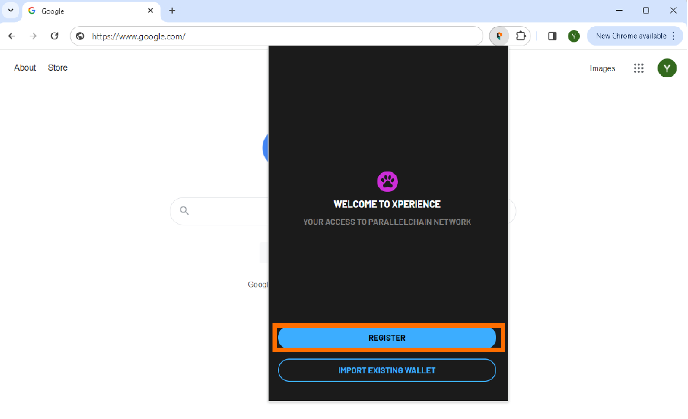
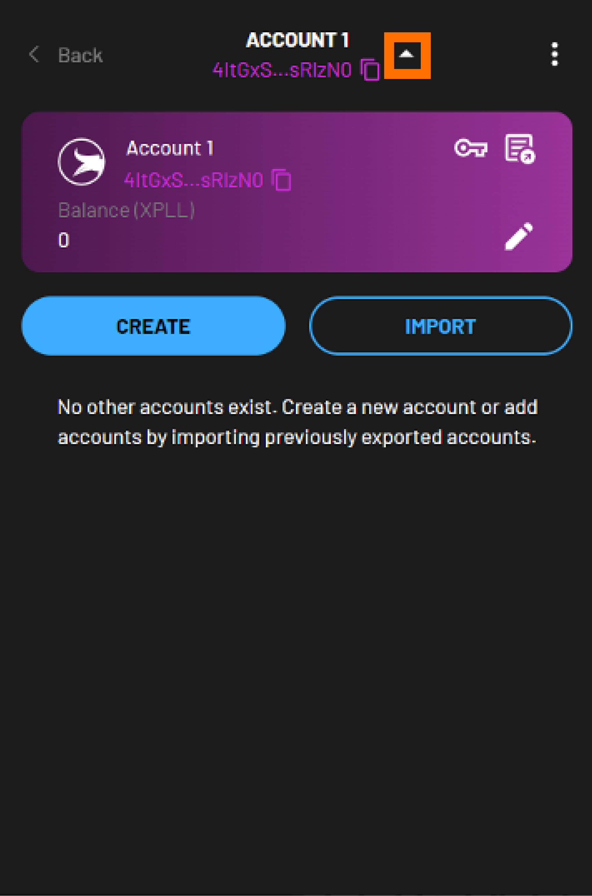

---
tags:
- Xperience browser extension
---
!!! note
    This process is the same on Xperience Browser Extension as it is on ParallelChain Explorer. 

**Xperience Browser Extension** is browser extension of your ParellelChain Explorer Wallet.

To conduct transactions on ParallelChain Mainnet you will first need to create an account on the blockchain to access the network. Accounts are free to create, and they can be set up through **Xperience Browser Extension**—or through the good old **ParallelChain Explorer**.

The blockchain account you create on ParallelChain is non-custodial, which means only you have control and access to it. You must store your recovery key securely and properly to avoid losing access to your assets. There is no way to retrieve it if it is lost. 

Learn how to create and manage your ParallelChain account using **Xperience Browser Extension** with the steps below. 

 

## Install **Xperience Browser Exension**

For Chrome users, install the extension via the [Chrome Web Store](https://chromewebstore.google.com/detail/xperience-browser-extensi/gpfllmjckejjhmmdmgbgmclmhopekjpf). The extension currently only works on Chrome.

If necessary, refer to [these instructions](https://support.google.com/chrome_webstore/answer/2664769?hl=en) on installing Chrome extensions.

## Register for a New Wallet

### Obtain Your Recovery Key
{ width=80%  style="display: block; margin: 0 auto" } 

1. Open Xperience Browser Extension by clicking on its icon next to your browser address bar.

2. Click **Register**.

3. Your **12-word recover key** will be generated automatically. Copy your recovery key by clicking **COPY AS TEXT** and paste it in a secure document, or by writing down the words in the exact order in which they appear.

4. Store your recovery key in a secure location.

5. Click **Next**.

### Verify Your Recovery Key
{ width=80%  style="display: block; margin: 0 auto" } 

1. You will be prompted to fill in some missing words in your recovery key. Refer to your recovery key to enter all the missing words in the blanks.

2. Click **Next**.

3. If an error message appears, refer to your recovery key again and check if you have entered the correct words.

### Create Your Password
1. Create a password for your wallet and enter it in the **Password** field. Your password can contain any characters, but it must satisfy the following conditions:
    - at least 8 characters long, 
    - at least 1 uppercase letter,
    - at least 1 lowercase letter, 
    - at least 1 number.

2. Enter your password again in the **Confirm Password** field. If you receive a `Passwords do not match` error, re-enter your password and check that both your entries are the same.

    !!! note
        This password is only limited to the wallet access on the particular device you are registering your account on, and it cannot be accessed from another device.

3. Click **REGISTER**. Congratulations! Your ParallelChain account has now been created.

4. You will be prompted to enter your password again to log in to your wallet.

## Importing an Existing Wallet

{ width=40%  style="display: block; margin: 0 auto" } 

1. Open **Xperience Browser Extension** by clicking on the extension icon next to your browser address bar.

2. Click **IMPORT EXISTING WALLET**.

3. Enter your 12-word recovery key that you had stored securely when you first created that wallet.

4. Click **Next**.

You will be prompted to create a password for your wallet. You can follow the instructions [here](#create-your-password).

!!! note
    Importing your wallet only recovers accounts associated with the recovery key. Refer to the steps in [Exporting Account](#exporting-account) and [Importing Account](#importing-account) to export and import individual accounts.

## Logging into Your Wallet

{ width=40%  style="display: block; margin: 0 auto" } 

1. Open **Xperience Browser Extension** by clicking on the extension icon next to your browser address bar.

2. Enter your password and click **VERIFY**. You can now access your wallet.

If you do not remember your password, you can reset your password with your recovery key:

1. Start by clicking **FORGOT PASSWORD**.

2. Enter the 12-word recovery key that you had stored securely when you first created your wallet. Click **NEXT**.

3. Follow the instruction in [Create Your Password](#create-your-password) to set up your new password.
<!-- 3. Create a new password for your wallet and enter it in the **PASSWORD** field. Your password can contain any characters, but it must satisfy the following conditions:
    - at least 8 characters long, 
    - at least 1 uppercase letter,
    - at least 1 lowercase letter, 
    - at least 1 number.

4. Enter your password again in the **CONFIRM PASSWORD** field. If you receive a `Passwords do not match` error, re-enter your password and check that both your entries are the same. Click **REGISTER**.

5. You will be prompted to enter your password again to log in to your wallet. Enter your new password and click **VERIFY**. You can now access your wallet. -->

## Configuring Your Security and Login

### Viewing Your Recovery Key

    
    

   1. Click the icon with three dots on the top-right corner of the extension.

   2. Click **Security & Login**.

   3. Enter your password and click **VERIFY**.

    !!! note
        If you do not remember your password, you can **log in with your recovery key**. 
        
        - Click **VERIFY WITH RECOVERY KEY**.
        
        - Enter your 12-word recovery key and click **Next**.

   6. Click **View Recovery Key**. You will see your 12-word recovery key.

### Changing Your Password

    
    

   1. Click the icon with the three dots on the top-right corner of the extension.

   2. Click **Security & Login**.

   3. Enter your password and click **VERIFY**.

    !!! note 
        If you do not remember your password, you can reset your password with your recovery key. 
       
        - Click **VERIFY WITH RECOVERY KEY**.
        - Enter your 12-word recovery key. Click **Next** and **Change Password**.

   4. Create a new password for your wallet and enter it in the **Password** field. Your password can contain any characters, but it must satisfy the following conditions:

    - at least 8 characters long, 
    - at least 1 uppercase letter,
    - at least 1 lowercase letter, 
    - at least 1 number.

   5. Enter your password again in the **Confirm Password** field. If you receive a `Passwords do not match` error, re-enter your password and check that both your entries are the same.
    
    !!! note 
        This password is only limited to the wallet access on the particular device you are registering your account on, and it cannot be accessed from another device.

         
   6. Click **SAVE CHANGES**. Your password has now been changed.

   7. You will be prompted to enter your password again to log in to your wallet.

### Erasing Wallet from Device

    
    

   1. Click the icon with three dots on the top-right corner of the extension.

   2. Click **Security & Login**.

   3. Enter your password and click **VERIFY**.

    !!! Note 
        If you do not remember your password, you can reset your password with your recovery key. 
       
        - Click **VERIFY WITH RECOVERY KEY**.
        - Enter your 12-word recovery key. Click **Next** and **Change Password**.

   6. Click **ERASE WALLET FROM DEVICE**. You will be prompted with a note that the action cannot be undone.

   7. Confirm by clicking **ERASE** to remove your wallet data from your device or click **CANCEL** to return to the previous screen.

## Exporting Account
### As Public and Private Keys

    
     

   1. Click the drop-down arrow right beside your wallet address.
   2. Your wallet address acts as your **public key**. Click the copy icon next to your public key to copy it and save it in a secure location.
   3. Click on the key icon to view your **private key**.
   4. Click on the copy icon next to your private key to copy it and save it in a secure location.

### As a JSON File
   Alternatively, you can download the **keypair** of your current account in a **JSON file**.
   

    
    
    

   
   1. Click the drop-down arrow right beside your wallet address.
   2. Click the download icon beside your wallet address to start the download.
   3. Store the JSON file securely. You can open the file with any text editor, like Notepad or Microsoft Word.

!!! Note 
    If you wish to recover your account on another wallet, you can do so by importing your accounts. Refer to the steps in [Importing Account](#importing-account).

## Importing Account
### Using Public and Private Keys
   

    
    
    

   1. Click the drop-down arrow right beside your wallet address.
   2. Click **IMPORT**.
   3. Enter your public key in the **Public Address** field.
   4. Enter your private key in the **Private Key** field.
   5. Enter your desired account name in the **Account Name** field.

    !!! note 
        If you are not sure where to find your public and private keys, refer to [Exporting Account as Public & Private Keys](#as-public-and-private-keys).
   
   6. Click **IMPORT**. You have successfully imported your account.

### Using a JSON File
   

    
    
    

   1. Click the drop-down arrow right beside your wallet address.
   2. Click **IMPORT**. 
   3. Click **IMPORT WITH FILE** and select the appropriate JSON file.
   
    !!! Note 
        If you are not sure how to export your JSON file, refer to [Exporting Account as a JSON File](#as-a-json-file).

   4. Click **IMPORT**. You have successfully imported your account.

## Locking Your Wallet

    
    

   1. Click the icon with three dots on the top-right corner of the extension.
   2. Click on **LOCK WALLET**. 
   3. Your wallet is now locked. You will be prompted to enter your password again to log in to your wallet.

## FAQ

### Is the wallet in Xperience Browser Extension the same as the wallet in ParallelChain Explorer?

Yes, they are the same. You can access your wallet through either **Xperience Browser Extension** or **ParallelChain Explorer**.

---

### Is my Xperience Browser Extension the same as my ParallelChain account?

No, they are not the same. Your ParallelChain account is the keypair registered on the **ParallelChain Mainnet**, and the Xperience browser extension is simply a platform that connects you to your ParallelChain account. You can access your ParallelChain account as long as you have your keypair, even if you lose the device the Xperience Browser Extension is installed on.

---

### Can I send XPLL tokens to other blockchains like Ethereum?

No, you cannot send XPLL tokens to other blockchains at the moment. XPLL and other PRFC tokens are currently only compatible with the ParallelChain Mainnet network, and sending your tokens to other network addresses will lose your tokens.

---

### What happens if I lose both my recovery key and password?

Xperience is a non-custodial wallet that only you have access to. If you lose your recovery key and password, you will lose access to your wallet. We recommend that you write down your recovery key and store it in a secure place.

If you have lost access to your existing wallet, you can opt to register for a new wallet by clearing the cache of your current browser, and then refreshing the page. Please check with your selected browser to find out how to clear your browser cache.
After that, register for a new wallet by following the steps under [Register for a New Wallet](#register-for-a-new-wallet).

If you have exported your public and private keys before, you can then recover access to your assets by importing your old account with its public and private keys. For more details, follow the steps under [Exporting Account](#exporting-account) and [Importing Account](#importing-account).

---

### Where can I seek support or report bugs?

You can visit ParallelChain's [Discord](https://discord.gg/parallelchainofficial) for community help. If you cannot resolve your issue there, you can write to [walletsupport@parallelchain.io](mailto:walletsupport@parallelchain.io).
