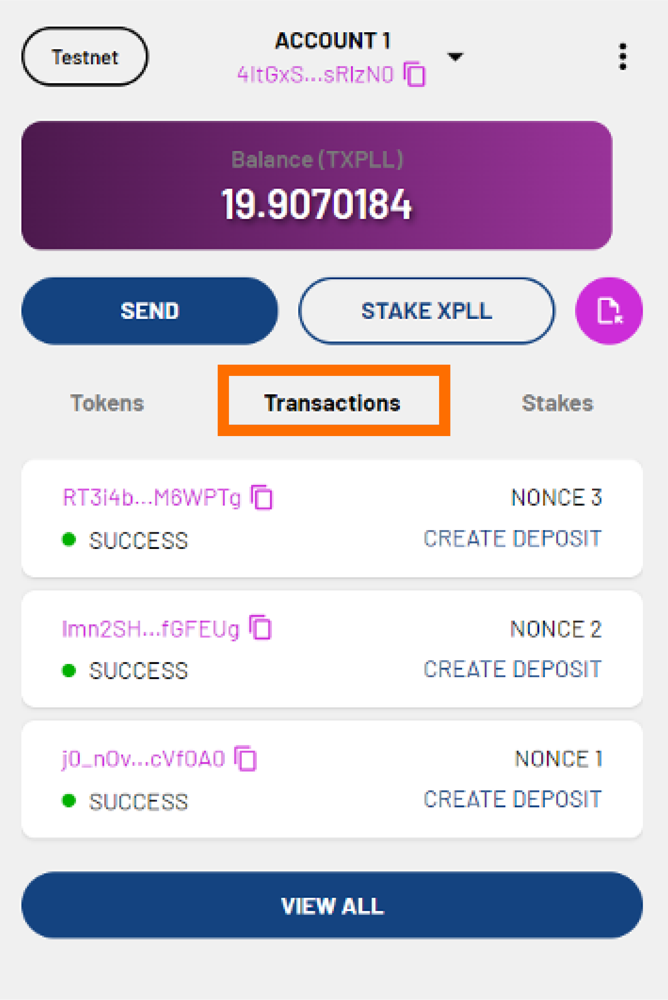

---
tags:
- Xperience extension
- staking
- xpll
---
!!! note
    This process is the same on Xperience Browser Extension as it is on ParallelChain Explorer. 

You can stake XPLL with network validators to help secure the blockchain and earn rewards. Follow the steps below to stake XPLL tokens with your ParallelChain account. 

!!! note

    Before you can perform the following steps, you need to have created and be logged in to your ParallelChain account. If you are not sure how to do so, refer to [Xperience Browser Extension Tutorials: Creating and Managing Your Account](./create_account.md). 

## Depositing Your XPLL

### Step 1: Select a Validator

{ width=40%  style="display: block; margin: 0 auto" } 
1. Click **STAKE XPLL**

2. You will see the list of validators. Select a validator from the list, or search for a specific validator via the search bar at the top.

### Step 2: Deposit XPLL
#### Through Your Account
{ width=40%  style="display: block; margin: 0 auto" } 

1. You will see the following details of the validator:
    - **Pool Name** - the name of the validator
    - **Operator** - the validator's address
    - **Pool Stake** - the number of XPLL staked with the validator
    - **Commission Fee** - the percentage of your rewards the validator will take as a commission fee
2. Enter the number of XPLL you wish to deposit in the **Deposit** field.
3. If you woould like to stake your rewards automatically, toggle the **Auto Stake Rewards** button on.
4. Click **Next**.

#### Through Your Lock-Up Contract

1. You will see the following details of the validator pool:
    - **Lock-Up Contract(XPLL)**/ **Locked** - the number of tokens that are still vested
    - **Pool Name** - the name of the validator
    - **Operator** - the validator's address
    - **Pool Stake** - the number of XPLL staked with the validator
    - **Commission Fee** - the percentage of your rewards the validator will take as a commission fee

2. The **Deposit** field will be automatically filled in for you when you deposit XPLL through your lock-up contract.
3. If you would like to stake your rewards automatically, toggle the **Auto Stake Rewards** button on.
4. Click **Next**.

### Step 3: Confirm Your Transaction
1. You will see the following additional fields:
    - **Nonce** - will be automatically filled in for you.
    - **Max Base Fee per Gas** - will be automatically filled in for you based on the current Base Fee per Gas of the network.
    - **Priority Fee per Gas** - determines the priority of your transaction. The minimum fee is 0 XPLL.
    - **Gas Limit** - will be automatically filled in for you.
    - **Estimated Gas Fee** - the approximate gas fee that will be charged for your transaction.

2. If you are satisfied with the fields, click **Next**.

3. Preview the summary of the transaction. Click **CONFIRM** to confirm or **CANCEL** to make edits.

4. You will see the details of the transaction. The transaction status will show **PENDING**. Click **CLOSE**.

    { width=40%  style="display: block; margin: 0 auto" } 

5. You can check the status of your transaction in the **Transaction** tab. It is labelled **CREATE DEPOSIT**. When the transaction is validated by the network, the transaction status will show **SUCCESS**. Your XPLL have now been deposited with the validator.

6. You can create more than one deposit by repeating the above process with different validators.

7. To start earning XPLL from staking, follow the instruction in the **Staking Your XPLL** section below.

## Staking Your XPLL
You can stake the XPLL that you ahve deposited with the validators to earn rewards.

### Step 1: Navigate to Your Chosen Validator
{ width=40%  style="display: block; margin: 0 auto" } 

1. On the main page, click the **Stakes** tab.

2. Click the validator that you wish to stake XPLL with.

3. You will see the following details of the validator:
    - **Pool Name** - the name of the validator.
    - **Operator** - the validator's address.
    - **Pool Stake** - the number of XPLL staked with the validator.
    - **Commission Fee** - the percentage of your rewards that validator will take as a commission fee.

    You will also see the following information:

    - **Deposit** - the number of XPLL you have deposited with the validator.
    - **Tentative Stake** - the number of XPLL you have in the validator pool that will become part of the current stake in the future.
    - **Current Stake** - the number of XPLL you have in the validator pool that is part of the current validator set and is now earning rewards.
    - **Auto Stake Rewards** - whether you have chosen to stake your rewards automatically.
    - **Next Epoch** - when the next epoch will occur.

    { width=40%  style="display: block; margin: 0 auto" } 
4. Click the arrow beside the **Tentative Stake** field. 

### Step 2: Stake XPLL
#### From Your Account
{ width=40%  style="display: block; margin: 0 auto" } 

1. You will see the following details of the validator:
    - **Pool Name** - the name of the validator.
    - **Operator** - the validator's address.
    - **Pool Stake** - the number of XPLL staked with the validator.
    - **Commission Fee** - the percentage of your rewards that validator will take as a commission fee.
    - **Deposit** - the number of XPLL you have deposited with the validator.
    - **Tentative Stake** - the number of XPLL you have in the validator pool that will become part of the current stake in the future.

2. If this is your first stake with the validator, you will see the **Stake** field. If you have an existing stake with the validator, click **STAKE**, and the **Stake** field will appear.

3. Enter the number of XPLL you wish to stake in the **Stake** field. The number cannot exceed the number of XPLL you have deposited.

4. Click **Next**.

#### From Your Lock-Up Contract

1. You will see the following details of the validator: 
    - **Lock-Up Contract (XPLL)**/**Locked** - the number tokens that are still vested. 
    - **Pool Name** - the name of the validator. 
    - **Operator** - the validator's address.
    - **Pool Stake** - the number of XPLL staked with the validator.
    - **Commission Fee** - the percentage of your rewards that validator will take as a commission fee.
    - **Deposit** - the number of XPLL you have deposited with the validator.
    - **Tentative Stake** - the number of XPLL you have in the validator pool that will become part of the current stake in the future.

2. The **Stake** fild will be automatically filled in for you hen you stake XPLL from your lock-up contract.

3. Click **Next**.

### Step 3: Confirm Your Transaction
1. You will see the following additional fields:
    - **Nonce** - will be automatically filled in for you.
    - **Max Base Fee per Gas** - will be automatically filled in for you based on the current Base Fee per Gas of the network.
    - **Priority Fee per Gas** - determines the priority of your transaction. The minimum fee is 0 XPLL.
    - **Gas Limit** - will be automatically filled in for you.
    - **Estimated Gas Fee** - the approximate gas fee that will be charged for your transaction.

2. If you are satisfied with the fields, click **NEXT**.
3. Preview the summary of the tranasction. Click **CONFIRM** to continue or **CANCEL** to make edits.
4. You will see the detais of the transaction. The transaction status will show **PENDING**. Click **CLOSE**.

    { width=40%  style="display: block; margin: 0 auto" } 

5. You can check the status of your transaction in the **Transactions** tab. It is labelled **STAKE DEPOSIT**. When the transaction is validated by the network, the transaction status will show **SUCCESS**. Your XPLL have now been staked with the validator. 

!!! note
    Depending on the network state when your transaction gets included, the actual amount may differ slightly from your desired amount. The staking will take approximately **two epochs** to be confirmed.

## Topping Up Your Stake

### Step 1: Navigate to Your Chosen Validator
{ width=40%  style="display: block; margin: 0 auto" } 

1. On the main page, click the **Stakes** tab.
2. Click the validator pool that you wish to top up your deposit with.
3. You will see the following details of the validator:
    - **Pool Name** - the name of the validator.
    - **Operator** - the validator's address.
    - **Pool Stake** - the number of XPLL staked with the validator.
    - **Commission Fee** - the percentage of your rewards that validator will take as a commission fee.

    You will also see the following information:

    - **Deposit** - the number of XPLL you have deposited with the validator.
    - **Tentative Stake** - the number of XPLL you have in the validator pool that will become part of the current stake in the future.
    - **Current Stake** - the number of XPLL you have in the validator pool that is part of the current validator set and is now earning rewards.
    - **Auto Stake Rewards** - whether you have chosen to stake your rewards automatically.
    - **Next Epoch** - when the next epoch will occur.

    .png){ width=40%  style="display: block; margin: 0 auto" } 

4. Click the arrow beside the **Deposit** field.

### Step 2: Top-Up Your Stake Through Your Account
.png){ width=40%  style="display: block; margin: 0 auto" } 

1. You will see the following details of the validator:
    - **Pool Name** - the name of the validator.
    - **Operator** - the validator's address.
    - **Pool Stake** - the number of XPLL staked with the validator.
    - **Commission Fee** - the percentage of your rewards that validator will take as a commission fee.
    - **Deposit** - the number of XPLL you have deposited with the validator.
    - **Tentative Stake** - the number of XPLL you have in the validator pool that will become part of the current stake in the future.

2. Click **TOP-UP** to deposit more XPLL with the validator.
3. The **Top-Up** field will appear. Enter the number of XPLL you wish to top up. The number cannot be more than your account balance.
4. Click **NEXT**.

### Step 3: Confirm Your Transaction
1. You will see the following additional fields:
    - **Nonce** - will be automatically filled in for you.
    - **Max Base Fee per Gas** - will be automatically filled in for you based on the current Base Fee per Gas of the network.
    - **Priority Fee per Gas** - determines the priority of your transaction. The minimum fee is 0 XPLL.
    - **Gas Limit** - will be automatically filled in for you.
    - **Estimated Gas Fee** - the approximate gas fee that will be charged for your transaction.

2. If you are satisfied with the fields, click **NEXT**.
3. Preview the summary of the transaction. Click **CONFIRM** to continue or **CANCEL** to make edits.
4. The transaction will show **PENDING**. Click **CLOSE**.

.png){ width=40%  style="display: block; margin: 0 auto" } 

5. You can check the status of your transaction in the **Transaction** tab. It is labelled **TOP UP DEPOSIT**. When the transaction is validated by the network, the transaction status will show **SUCCESS**. Your deposit has now been topped up.

## Unstaking Your XPLL

### Step 1: Navigate to Your Chosen Validator

{ width=40%  style="display: block; margin: 0 auto" } 

1. On the main page, click the **Stakes** tab.
2. Click the validator pool that you wish to unstake XPLL from.
3. You will see the following details of the validator:
    - **Pool Name** - the name of the validator.
    - **Operator** - the validator's address.
    - **Pool Stake** - the number of XPLL staked with the validator.
    - **Commission Fee** - the percentage of your rewards that validator will take as a commission fee.

    You will also see the following information:

    - **Deposit** - the number of XPLL you have deposited with the validator.
    - **Tentative Stake** - the number of XPLL you have in the validator pool that will become part of the current stake in the future.
    - **Current Stake** - the number of XPLL you have in the validator pool that is part of the current validator set and is now earning rewards.
    - **Auto Stake Rewards** - whether you have chosen to stake your rewards automatically.
    - **Next Epoch** - when the next epoch will occur.

    { width=40%  style="display: block; margin: 0 auto" } 

4. Click the arrow beside the **Tentative Stake** field.
 
### Step 2: Unstake XPLL

#### To Your Account

{ width=40%  style="display: block; margin: 0 auto" } 

1. You will see the following details of the validator:
    - **Pool Name** - the name of the validator.
    - **Operator** - the validator's address.
    - **Pool Stake** - the number of XPLL staked with the validator.
    - **Commission Fee** - the percentage of your rewards that validator will take as a commission fee.
    - **Deposit** - the number of XPLL you have deposited with the validator.
    - **Tentative Stake** - the number of XPLL you have in the validator pool that will become part of the current stake in the future.

2. Click **UNSTAKE**.
3. The **Unstake** field will appear. Enter the number of XPLL you wish to unstake. The number cannot exceed the number of XPLL you have staked.
4. Click **NEXT**.

#### To Your Lock-Up Contract
1. You will see the following details of the validator: 
    - **Lock-Up Contract (XPLL)**/**Locked** - the number tokens that are still vested. 
    - **Pool Name** - the name of the validator. 
    - **Operator** - the validator's address.
    - **Pool Stake** - the number of XPLL staked with the validator.
    - **Commission Fee** - the percentage of your rewards that validator will take as a commission fee.
    - **Deposit** - the number of XPLL you have deposited with the validator.
    - **Tentative Stake** - the number of XPLL you have in the validator pool that will become part of the current stake in the future.

2. The **Unstake** field will be automatically filled in for you when you unstake XPLL to your lock-up contract.
3. Click **NEXT**.

### Step 3: Confirm Your Transaction
1. You will see the following additional fields:
    - **Nonce** - will be automatically filled in for you.
    - **Max Base Fee per Gas** - will be automatically filled in for you based on the current Base Fee per Gas of the network.
    - **Priority Fee per Gas** - determines the priority of your transaction. The minimum fee is 0 XPLL.
    - **Gas Limit** - will be automatically filled in for you.
    - **Estimated Gas Fee** - the approximate gas fee that will be charged for your transaction.

2. If you are satisfied with the fields, click **NEXT**.
3. Preview the summary of the tranasction. Click **CONFIRM** to continue or **CANCEL** to make edits.
4. You will see the detais of the transaction. The transaction status will show **PENDING**. Click **CLOSE**.

    { width=40%  style="display: block; margin: 0 auto" } 

5. You can check the status of your transaction in the **Transactions** tab. It is labelled **UNSTAKE DEPOSIT**. When the transaction is validated by the network, the transaction status will show **SUCCESS**. Your XPLL have now been unstaked from the validator.
!!! note
    Depends on the network state when your transaction gets included, the actual amount may differ slightly from your desired amount. The staking will take approximately **two epochs** to be confirmed.

## Withdrawing Your Stakes

### Step 1: Navigate to Your Chosen Validator

.png){ width=40%  style="display: block; margin: 0 auto" } 

1. On the main page, click the **Stakes** tab.
2. Click the validator that you wish to withdraw XPLL from.
3. You will see the following details of the validator:
    - **Pool Name** - the name of the validator.
    - **Operator** - the validator's address.
    - **Pool Stake** - the number of XPLL staked with the validator.
    - **Commission Fee** - the percentage of your rewards that validator will take as a commission fee.

    You will also see the following information:

    - **Deposit** - the number of XPLL you have deposited with the validator.
    - **Tentative Stake** - the number of XPLL you have in the validator pool that will become part of the current stake in the future.
    - **Current Stake** - the number of XPLL you have in the validator pool that is part of the current validator set and is now earning rewards.
    - **Auto Stake Rewards** - whether you have chosen to stake your rewards automatically.
    - **Next Epoch** - when the next epoch will occur.

    { width=40%  style="display: block; margin: 0 auto" } 

4. Click the arrow beside the **Deposit** field.
 
### Step 2: Withdraw Stakes

#### To Your Account

{ width=40%  style="display: block; margin: 0 auto" } 

1. You will see the following details of the validator:
    - **Pool Name** - the name of the validator.
    - **Operator** - the validator's address.
    - **Pool Stake** - the number of XPLL staked with the validator.
    - **Commission Fee** - the percentage of your rewards that validator will take as a commission fee.
    - **Deposit** - the number of XPLL you have deposited with the validator.
    - **Tentative Stake** - the number of XPLL you have in the validator pool that will become part of the current stake in the future.

2. Click **WITHDRAW** to withdraw XPLL from your validator deposit.
3. The **Withdraw** field will appear. Enter the number of XPLL you wish to withdraw. The number cannot be more than your account balance.
4. Click **NEXT**.

#### To Your Lock-Up Contract
1. You will see the following details of the validator: 
    - **Lock-Up Contract (XPLL)**/**Locked** - the number tokens that are still vested. 
    - **Pool Name** - the name of the validator. 
    - **Operator** - the validator's address.
    - **Pool Stake** - the number of XPLL staked with the validator.
    - **Commission Fee** - the percentage of your rewards that validator will take as a commission fee.
    - **Deposit** - the number of XPLL you have deposited with the validator.
    - **Tentative Stake** - the number of XPLL you have in the validator pool that will become part of the current stake in the future.

2. The **Withdraw** field will be automatically filled in for you when you withdraw XPLL to your lock-up contract. Depends on the time when you withdraw your XPLL, the withdrawal may be split between your lock-up contract's locked and unlocked tokens.
3. Click **NEXT**.

### Step 3: Confirm Your Transaction
1. You will see the following additional fields:
    - **Nonce** - will be automatically filled in for you.
    - **Max Base Fee per Gas** - will be automatically filled in for you based on the current Base Fee per Gas of the network.
    - **Priority Fee per Gas** - determines the priority of your transaction. The minimum fee is 0 XPLL.
    - **Gas Limit** - will be automatically filled in for you.
    - **Estimated Gas Fee** - the approximate gas fee that will be charged for your transaction.

2. If you are satisfied with the fields, click **NEXT**.
3. Preview the summary of the tranasction. Click **CONFIRM** to continue or **CANCEL** to make edits.
4. You will see the detais of the transaction. The transaction status will show **PENDING**. Click **CLOSE**.

    { width=40%  style="display: block; margin: 0 auto" } 

5. You can check the status of your transaction in the **Transactions** tab. It is labelled **WITHDRAW DEPOSIT**. When the transaction is validated by the network, the transaction status will show **SUCCESS**. Your XPLL have now been withdrawn.
!!! note
    Depending on the network state when your transaction gets included, the actual amount may differ slightly from your desired amount. The staking will take approximately **two epochs** to be confirmed.

## FAQ

### Why am I not able to stake XPLL tokens?
You will need to retain a certain number of XPLL in your account balance to pay for transaction fees. Ensure that you have reserved enough XPLL to pay for the gas fees for depositing, staking, unstaking, topping up, or withdrawing XPLL.

---

### How do I know which validator to stake with?
All the validators securing ParallelChain Mainnet are trusted participants who are required to stake a significant number of XPLL. You can check the yield and commission fee of each validator by tapping on the drop-down arrow of the **Operator** field.

---

### How long is the unstaking period?
The staking duration is measured by epochs. If you stake and unstake within the same epoch, the waiting time is considerably shorter. If you do not stake and unstake within the same epoch, you will need to wait at least for another two epochs before unstaking. 
 
---

### How long is an epoch? 
One full epoch lasts approximately **one day** before it enters the next epoch. The epoch is a protocol-defined period for measuring performance of operators on the network. 

---

### How do I withdraw my staking rewards? 

You can withdraw the rewards you have earned from staking by unstaking them to your token deposit. Additionally, you may toggle **Auto Stake Rewards** on to avoid the process of unstaking your rewards. After that, you can withdraw the rewards to your account balance. Please refer to the section on [Unstaking Your XPLL](#unstaking-your-xpll) and [Withdrawing Your Stakes](#withdrawing-your-stakes) for the required steps. 

---

### Can I move my staked XPLL to another validator? 
Yes, you can. You will need to *unstake your XPLL tokens* to move them to your token deposit, then *withdraw them to your account balance*. You can then *deposit those tokens to another validator pool*, then *stake your tokens* with them.  

---

### The transaction status is still showing ‘PENDING’. Why is my transaction not confirmed yet? 

Transactions are prioritised by the amount of *Priority Fee per Gas* paid. Lower priority transactions may need more time to be confirmed. You may choose to pay a higher Priority Fee during peak periods for a faster transaction, or continue checking your wallet address to monitor the transaction status. 

---

### Where can I seek support or report bugs? 

You can visit ParallelChain’s [Discord](https://discord.gg/parallelchainofficial) for community help. If you cannot resolve your issue there, you can write to [walletsupport@parallelchain.io](mailto:walletsupport@parallelchain.io). 