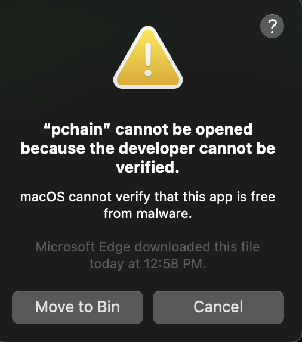

---
tags:
  - testnet 3
  - parallelchain client
  - tutorial
---

# Installation

## Introduction
---

ParallelChain client (`pchain_client`) is a command-line tool for you to connect and interact with the ParallelChain Mainnet. `pchain_client` supports Windows and Linux/MacOs.

Throughout the section, we will describe how to transfer tokens, deploy smart contract and call contract with real world examples by using `pchain_client`.

## For Windows 
---

Download the compressed zip file from [https://cms.parallelchain.io/parallelchain-client_v0.3.1_win.zip](https://cms.parallelchain.io/parallelchain-client_v0.3.1_win.zip)

Unzip the file to extract the executable `pchain_client.exe`. 


To open Command Prompt, type *WIN+R* and input `cmd`:


Head to the directory where `pchain_client.exe` is located via `cd`. For example, the executable is located at C:\Development:


Run the command `pchain_client.exe` and see usage page.

Congratulations. You have successfully installed `pchain_client` and are ready to proceed to ["Prepare Environment"](prepare_env.md)

### For Powershell User

This section describes using `PowerShell` as the command line utility to install ParallelChain Light Client. 

Open up `PowerShell` using the `run` keyboard shortcut. That is *WIN+R* and type in `powershell` to proceed. 

Unzip the compressed zip file by `Expand-Archive`. Please specify the source path and destination path for your command parameters:

-  `<SOURCE_PATH>`: the directory where `parallelchain-client_v0.3.1_win.zip` is located.
-  `<DESTINATION_PATH>`: the directory you intend to install `pchain_client`. 

```PowerShell
Expand-Archive -LiteralPath 'C:\<SOURCE_PATH>\parallelchain-client_v0.3.1_win.zip' -DestinationPath 'C:\<DESTINATION_PATH>\pchain_client.exe'
```

To switch the operating mode of `PowerShell` from a normal mode to administrator mode:
```PowerShell
Start-Process powershell -Verb runAs
```

Head to the destination directory where `pchain_client.exe` is extracted:
```PowerShell
Set-Location C:\<DESTINATION_PATH>\
```

Run the command `pchain_client` to see if it launches.
```PowerShell
pchain_client.exe
```
<details>
  <summary>To verify that the Light Client works</summary>
    pchain is now an executable from anywhere on your system
    ```bash
    ParallelChain F Client CLI v.0.3.1
    <ParallelChain Lab>
    pchain-client is an (experimental) CLI for interacting with ParallelChain F (Mainnet) networks. If
    you're new, start by setting up CLI using the 'Setup' command.
    ```
</details>

Congratulations. You have successfully installed `pchain_client` and are ready to proceed to ["Prepare Environment"](prepare_env.md)

## For Linux / macOS
---

In this section, most of the commands between the two operating systems are the same. If there are any differences, a
tab that states a command for a particular operating system will be shown as below:

=== "Linux"
    ```bash
    echo "This is a linux command"
    ```
=== "macOS"
    ```bash
    echo "This is a macOS command"
    ```

To download the precompiled compressed binaries, use:

=== "Linux"
    ```bash
    wget https://cms.parallelchain.io/parallelchain-client_v0.3.1_linux.tar.xz
    ```
=== "macOS"
    ```bash
    curl -O https://cms.parallelchain.io/parallelchain-client_v0.3.1_mac.tar.xz
    ```

To extract the client program, head to the directory where the downloaded file `parallelchain-client_v0.3.1_linux.tar.xz` or  `parallelchain-client_v0.3.1_mac.tar.xz` is located and extract via `tar`:
=== "Linux"
    ```bash
    tar -xvf parallelchain-client_v0.3.1_linux.tar.xz
    ```
=== "macOS"
    ```bash
    tar -xvf parallelchain-client_v0.3.1_mac.tar.xz
    ```

Run the command `pchain_client` to see if it launches.
=== "Linux"
    ```bash
    ./pchain_client
    ```
=== "macOS"
    ```bash
    ./pchain_client
    ```

    !!! Tip
        **For macOS users**: _Newer versions of macOS contain extra security verification steps configured by default. This is called [GateKeeper](https://support.apple.com/en-gb/guide/security/sec5599b66df/web). This usually happens when you download the binaries from a browser instead of using the `curl` tool as mentioned in the previous step. In case you found a message like this when calling `pchain_client`_:
        ```bash
        ./pchain
        ```
        

        then you can remove macOS' "GateKeeper" attributes from `pchain_client` by this command and run pchain as normal
        ```bash
        sudo xattr -rd com.apple.quarantine ./pchain_client
        ```

        This is an elevated action, so you will need to enter your password to continue. `pchain_client` can now be used as normal.

<details>
  <summary>To verify that the Client works</summary>
    ```bash
    ParallelChain F Client CLI v.0.3.1
    <ParallelChain Lab>
    pchain-client is an (experimental) CLI for interacting with ParallelChain F (Mainnet) networks. If
    you're new, start by setting up CLI using the 'Setup' command.
    ```
</details>

Congratulations. You have successfully installed `pchain_client`.

!!! Tip

    You might want to store `pchain_client` in a directory of your choice so that it is easier to follow the commands in the tutorial. For example, we created a folder in our home directory called parallelchain_client:
    ```bash
    $ mkdir -p /home/my_user/parallelchain_client
    $ cp pchain_client /home/my_user/parallelchain_client/
    $ cd /home/my_user/parallelchain_client
    $ ./pchain_client
    ```

    So from now on, when you see a command like this in linux/macOS:
    ```bash
    ./pchain_client
    ```

    It means that `pchain_client` shall be executed from the directory you stored `pchain_client` in.

