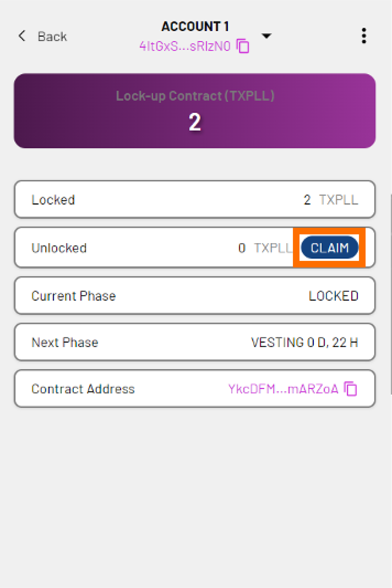

---
tags:
- Xperience extension
- xpll
- lockup contract
---
!!! note
    This process is the same on Xperience Browser Extension as it is on ParallelChain Explorer. 

Your XPLL allocation might be subject to a **vesting schedule** that determines how many of your tokens are vested (unlocked) as time goes on. You need to first *register the lock-up contract of your allocation* to your account so you can *claim your unlocked tokens* in the future, 

!!! note 
    Each lock-up contract is unique to its holder.  

Follow the steps below to register your lock-up contract and claim your tokens with your ParallelChain wallet.  

!!! note
    Before you can perform the following steps, you need to have created and logged in to your ParallelChain account. If you are not sure how to do so, refer to [Xperience Browser Extension Tutorials: Creating and Managing Your Account](./create_account.md). 

## Registering Your Lock-Up Contract
---
### Step 1: Get Your Lock-Up Contract Address 
1. Your lock-up contract address would have been sent to you **via email**. Check your email and copy your lock-up contract address.

### Step 2: Register Your Lock-Up Contract 
{ width=40%  style="display: block; margin: 0 auto" } 

1. Click the *pink file* icon to the right of **STAKE XPLL**. 

2. Enter your lock-up contract address in the **input contract address** field. 

3. Click **REGISTER**. 

3. You will see the following information: 

    - **Locked** - the tokens that currently cannot be claimed. 

    - **Unlocked** - the tokens that currently can be claimed. 

    - **Current Phase** - the vesting phase that we are in at the moment. 

    - **Next Phase** - the amount of time left before your tokens are vested. 

    - **Contract Address** - your lock-up contract address.  

    !!! note
        You will have to manually claim the vested tokens to have them transferred to your normal account. 

4. Click **CONFIRM**. Your lock-up contract has now been registered. 

    { width=40%  style="display: block; margin: 0 auto" } 

5. You will be taken back to the main page. If you scroll right, you will see your **Lock-Up Contract (XPLL)** balance next to your main balance. 

!!! note
    Your account comes with a small number of XPLL to pay for the gas fee for the first transaction. For Node Round participants who will operate validator nodes on ParallelChain, the locked balance shown will be **0**, as your allocation has been automatically staked on one of the existing validator nodes. 

## Claiming Your Vested Tokens
---
### Step 1: Check Your Vested Balance 
{ width=40%  style="display: block; margin: 0 auto" } 

1. Click the *pink file* icon to the right of **STAKE XPLL**. 

2. You will see the following information: 

    - **Locked** - the tokens that currently cannot be claimed. 

    - **Unlocked** - the tokens that currently can be claimed. 

    - **Current Phase** - the vesting phase that we are in at the moment. 

    - **Next Phase** - the amount of time left before your tokens are vested. 

    - **Contract Address** - your lock-up contract address.  

### Step 2: Claim Your Vested Tokens 
{ width=40%  style="display: block; margin: 0 auto" } 

1. Click **CLAIM** in the **Unlocked** field. 

2. You will see two additional fields: 

    - **Balance** - the number of tokens currently in your account. 

    - **Claim** - the number of tokens you wish to claim. 

3. In the **Claim** field, enter the number of XPLL you wish to claim. This number cannot be more than the number in the **Unlocked** field. 

4. Click **NEXT**. 

5. You will see the following additional fields: 

    - **Nonce** - will be automatically filled in for you. 

    - **Max Base Fee per Gas** - will be automatically filled in for you. The minimum fee is 8 XPLL. 

    - **Priority Fee per Gas** - determines the priority of your transaction. The minimum fee is 0. 

    - **Gas Limit** - will be automatically filled in for you. 

    - **Estimated Gas Fee** - the approximate gas fee that will be charged for your transaction. 

6. If you are satisfied with the fields, click **NEXT**. 

7. Preview the summary of the transaction. Click **CONFIRM** to continue or **CANCEL** to make edits. 

8. The transaction status will show **PENDING**. Click **CLOSE**. 

9. You can check the status of your transaction in the **Transactions** tab. When the transaction is validated by the network, the transaction status will show **SUCCESS**. The claimed tokens have now been transferred to your account. 

## FAQ
---
### Do I need to wait for the full vesting period before I can claim the locked XPLL? 

A set number of XPLLs will be unlocked after a set period of time. The unlocked number of XPLL will be displayed in the **Unlocked** field. You may choose to claim the XPLL each time it is unlocked, but **note that gas fees will have to be paid for each claim**. You may also choose to accumulate the unlocked XPLL and claim it in one transaction. 

### Where can I seek support or report bugs? 
You can visit ParallelChain’s [Discord](https://discord.gg/parallelchainofficial) for community help. If you cannot resolve your issue there, you can write to [walletsupport@parallelchain.io](mailto:walletsupport@parallelchain.io). 