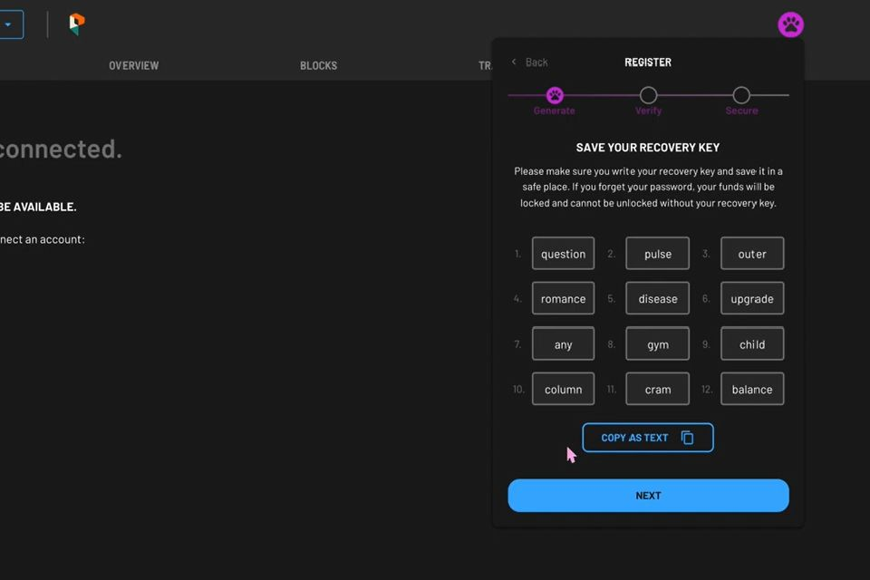
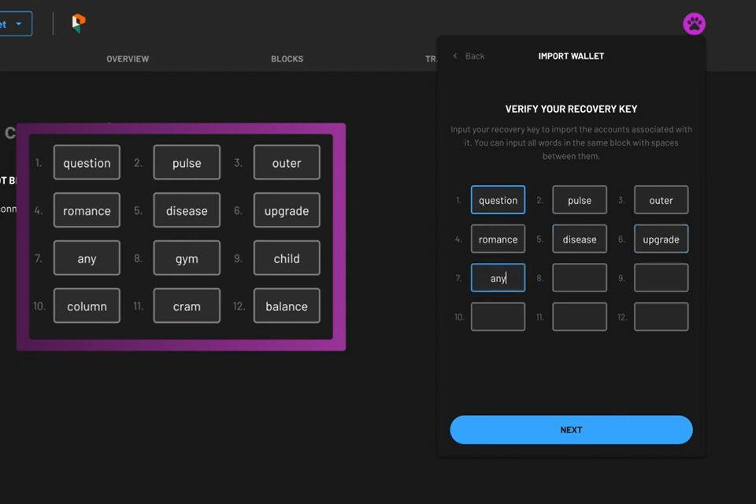
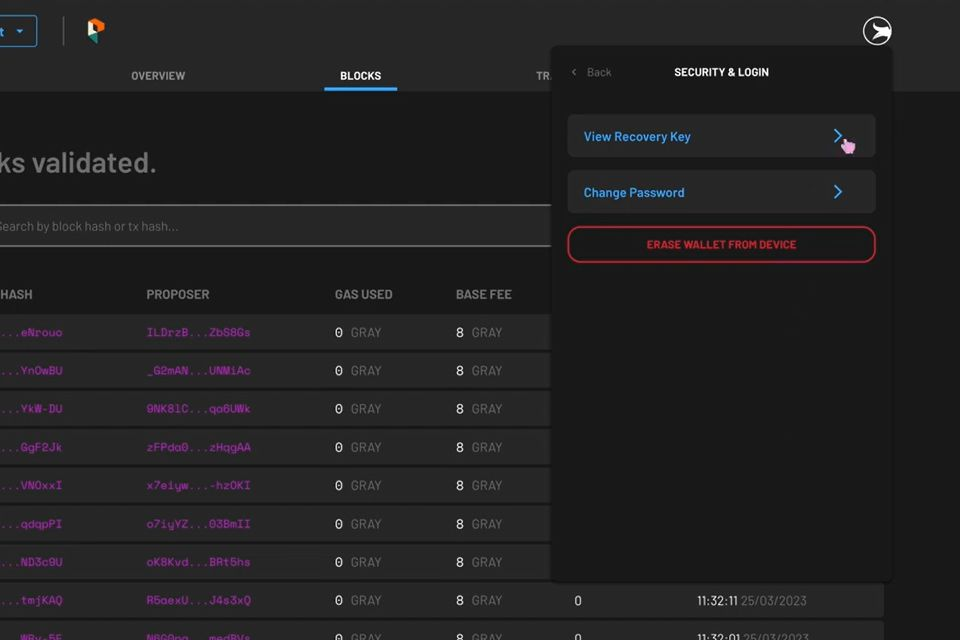
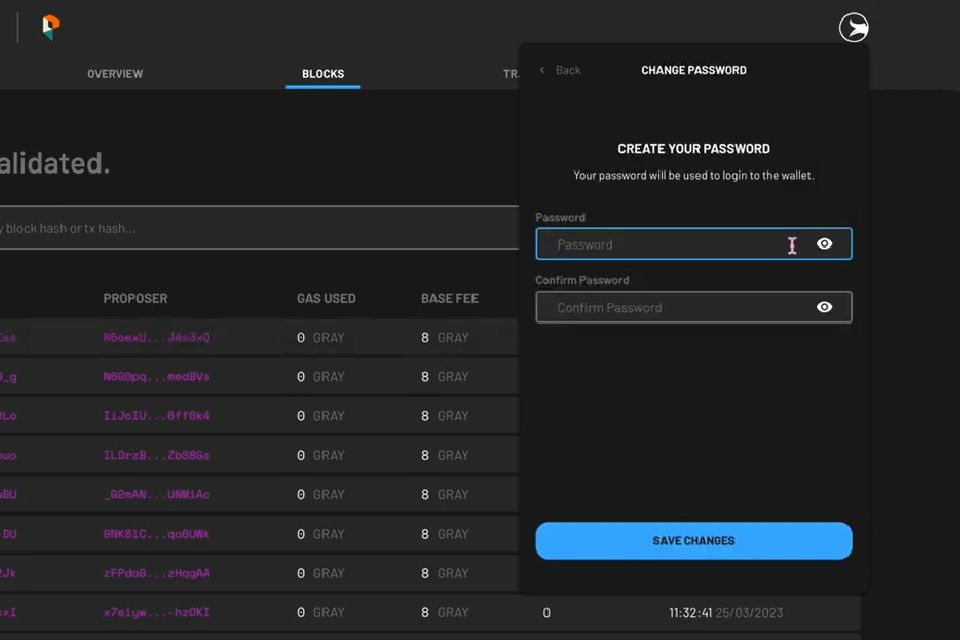
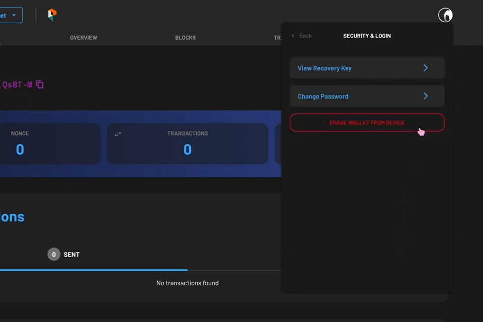
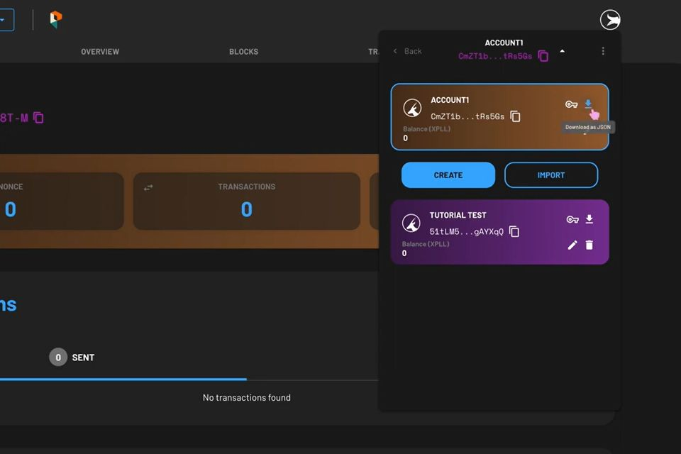
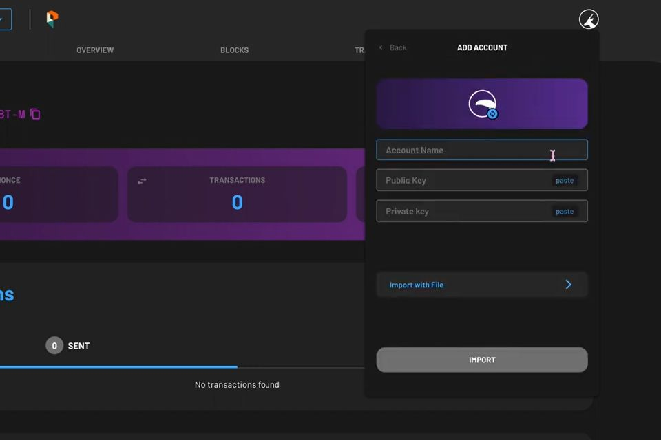
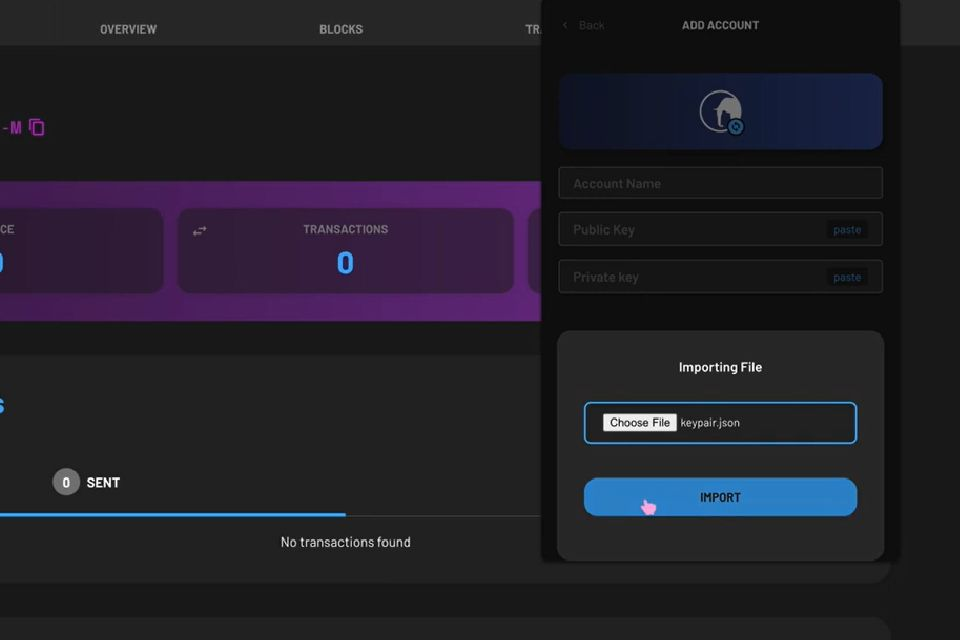
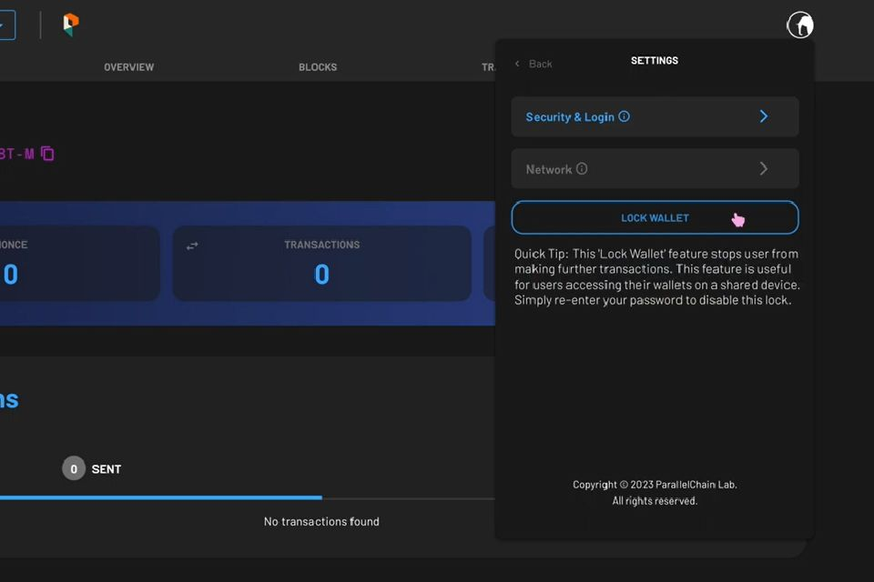

---
tags:
- Xperience
- explorer
---

**Xperience** is your ParallelChain wallet, and **ParallelChain Explorer** is a web-based tool that allows you to access your wallet.
 
To conduct transactions on ParallelChain Mainnet you will first need to create an account on the blockchain to access the network. Accounts are free to create, and they can be set up through **ParallelChain Explorer**—or through the new **Xperience Browser Extension**.
 
The blockchain account you create on ParallelChain is non-custodial, which means only you have control and access to it. You must store your recovery key securely and properly to avoid losing access to your assets. There is no way to retrieve it if it is lost.
 
Learn how to create and manage your ParallelChain account using **ParallelChain Explorer** with the steps below.

## Creating Your ParallelChain Mainnet Account
---

{ width=80%  style="display: block; margin: 0 auto" } 

### Step 1: Access ParallelChain Explorer

Access [ParallelChain Explorer](https://explorer.parallelchain.io/explorer?network=Mainnet) to start your account creation process.

### Step 2: Create Your Account

1. Create your ParallelChain wallet account by selecting **CONNECT NOW**.
2. Click the **REGISTER** button.
3. Your 12-word recovery key will be generated automatically. You should copy your recovery key by clicking **COPY AS TEXT** and pasting it in a secure document, or you should write it down. Store it in a safe and secure location.
4. Take note that the phrases are stored in a chronological order.
5. Click **NEXT** once you have stored it safely

### Step 3: Verify Your Recovery Key

1. To make sure that your recovery key are stored securely, you will be prompted to fill in blanks which correspond to the phrases displayed in the previous step.
2. Enter the words which correspond to the chronological positions of the recovery key.
3. Press **NEXT** when you are done.
4. If an error message appears, refer to your recovery key again and check if you have keyed in the wrong phrase.

### Step 4: Create Your Password

1. Create a password for your wallet. Your password can contain any characters, and it must be at least 8 characters long.
2. This password is only limited to the wallet access on the particular device you are registering your account on, and it cannot be used on another device.
3. Under **Confirm Password**, enter your password again. If you receive a **Password mismatched** error, please re-enter your password again and check that both of them are exactly the same.
4. Press the **REGISTER** button to proceed.
5. You will be prompted to enter your password again to access your wallet. Enter your password in the empty field, then click **VERIFY**.

### Step 5: Logging Into Your Wallet

1. To log in, click on the round icon on the top right hand corner of the webpage and enter your password
2. Press the **VERIFY** button.
3. If you do not remember your password, you can choose to log in with your recovery key. Start by selecting **FORGOT PASSWORD**.
4. Re-enter your 12-phrase recovery key that you have stored securely when you first created your wallet, then press **NEXT**.
5. Create a password for your wallet. Your password can contain any characters, and it must be at least 8 characters long.
6. Under **Confirm Password**, enter your password again. If you receive a **Password mismatched** error, please re-enter your password again and check that both of them are exactly the same.
7. Press the **REGISTER** button to proceed. You can now access your wallet account.

## Importing An Existing Wallet

{ width=80%  style="display: block; margin: 0 auto" } 

1. To import an existing ParallelChain wallet, click on the round icon on the top right hand corner of the webpage, followed by **IMPORT EXISTING WALLET**.
2. Enter your 12-phrase recovery key that you have stored securely when you first created your wallet, then press **NEXT**.
3. Next, enter your desired password and re-enter it under the **Confirm Password** box, then press **REGISTER**.
4. You will be prompted to enter your password again to access your wallet. Enter your password in the empty field, and select **VERIFY**.
5. Importing your wallet only recovers accounts associated with the recovery key. Refer to the steps under [Exporting Your Account With Public And Private Keys](#exporting-your-account-with-public-and-private-keys) and [Importing Your Account Using Public And Private Keys](#importing-your-account-using-public-and-private-keys) to export and import individual accounts.

## Configure Your Security & Login

### View Your Recovery Key
{ width=80%  style="display: block; margin: 0 auto" } 

1. Click the icon with three dots on the top right hand corner of the wallet.
2. To view your recovery key, tap on **Security & Login**, then enter your current password, followed by **VERIFY**.
3. If you do not remember your password, you can choose to log in with your recovery key by selecting **VERIFY WITH RECOVERY KEY** and re-entering your 12-phrase recovery key.
4. Tap on **VIEW RECOVERY KEY** to preview your recovery key.

### Change Passwords
{ width=80%  style="display: block; margin: 0 auto" } 

1. Click the icon with three dots on the top right hand corner of the wallet.
2. To change passwords, tap on **Security & Login**, then enter your current password, followed by **VERIFY**.
3. If you do not remember your password, you can choose to log in with your recovery key by selecting **VERIFY WITH RECOVERY KEY** and re-entering your 12-phrase recovery key.
4. Tap on **Change Password** to change your password. Enter the new password in the **Password** field, then enter your password again under **Confirm Password**. If you receive a **Password mismatched** error, please re-enter your password again and check that both of them are exactly the same.
5. Press the **SAVE CHANGES** button to proceed.
6. You will be prompted to enter your password again to access your wallet. Enter your password in the empty field.

### Erase Wallet From Device
{ width=80%  style="display: block; margin: 0 auto" } 

1. Click the icon with three dots on the top right hand corner of the wallet.
2. To erase your wallet from the current device, tap on **Security & Login**, then enter your current password, followed by **VERIFY**.
3. Tap on **ERASE WALLET FROM DEVICE**, and you will be prompted with a warning that the action cannot be undone. Select **ERASE** if you wish to proceed, or select **CANCEL** if you do not want to erase your wallet from the device.
4. You will be prompted to enter your password again to confirm your action. Key in your password in the **Password** field and select **VERIFY**.
5. If you do not remember your password, you can choose to log in with your recovery key by selecting **VERIFY WITH RECOVERY KEY** and re-entering your 12-phrase recovery key.
6. You will be shown a loading screen that says **Erasing Wallet Data**. Your wallet data has now been removed from your device.

### Exporting Your Account With Public And Private Keys
{ width=80%  style="display: block; margin: 0 auto" } 

1. To export an existing account, click on the *drop-down arrow* right beside your wallet address. Your wallet address acts as your **public key**.
2. Click on the *key* icon to preview your account **private key**.
3. Save your public and private key in a secure location.
4. You can also download the key pair of your current account through the *download* icon beside your wallet address as a **JSON file**.
5. Store the JSON file in a secure manner. If you wish to recover your account on another wallet, you can do so by following the instructions under [Importing Your Account Using Public And Private Keys](#importing-your-account-using-public-and-private-keys), or import it with the JSON file under [Importing Your Account With A JSON file](#importing-your-account-with-a-json-file). You can view the information by opening the file with a text-based document such as Microsoft Word.

### Importing Your Account Using Public And Private Keys
{ width=80%  style="display: block; margin: 0 auto" } 

1. To import an existing account, click on the *drop-down arrow* right beside your wallet address
2. Click the **IMPORT** button.
3. Enter your desired account name under the **Account Name**
4. Enter your public key in the **Public Key** field.
5. Enter your private key in the **Private Key** field.
6. If you are not sure where to find your public and private key, learn how to find them under [Exporting Your Account With Public And Private Keys](#exporting-your-account-with-public-and-private-keys).
7. Click **IMPORT** once you are done.

### Importing Your Account With A JSON file
{ width=80%  style="display: block; margin: 0 auto" } 

1. To import an existing account, click on the *drop-down arrow* right beside your wallet address.
2. Click the **IMPORT** button
3. Click on **Import With File** and select the appropriate JSON file. Learn how to export your JSON file under [Exporting Your Account With Public & Private Keys](#exporting-your-account-with-public-and-private-keys).
4. Once you are done, click on **IMPORT** and your account will be added to the wallet.

### Locking Your Wallet
{ width=80%  style="display: block; margin: 0 auto" } 

1. Click the icon with *three dots* on the top right hand corner of the wallet.
2. Tap on **LOCK WALLET** to keep your wallet locked.
3. You will be prompted to enter your password to access your wallet. Enter your password in the empty field and press **VERIFY’**.

## Navigating Your ParallelChain wallet
---  

1. **Congratulations** on creating your ParallelChain account.
2. Your first account will be automatically created for you.
3. You will find your account address on the top. Click to copy if needed.
4. Your XPLL balance is shown in the **Balance (XPLL)** field.
5. The **SEND** button and **STAKE** button allows you to send XPLL tokens to others, or stake XPLL tokens with network validators.
6. You can tap the **SEND** button to start transferring XPLL tokens to other users.
7. The top right corner of the wallet is indicated by *three dots* which lets you navigate to your wallet settings
8. If you are unsure of any particular steps while following the tutorial guide, you can also watch the video tutorial [here](https://www.youtube.com/watch?v=_lDRXPmeNzU).

## FAQ 
---

### Are my ParallelChain wallet and account the same thing?

No, your wallet and your account are not the same. Your account is registered on ParallelChain Mainnet, and your wallet extension helps connect you to your account. This means you are able to recover your account should you lose the device that your wallet extension is installed.

### What kind of digital assets can I store in my Xperience account?

Currently, it can store XPLL. In the near future, you will be able to store other ParallelChain-based cryptocurrencies and non-fungible tokens (NFTs).

### Can I send XPLL tokens to other blockchains like Ethereum?

No, you cannot send XPLL tokens to other blockchains at the moment. XPLL and other PRFC tokens currently only exist on ParallelChain Mainnet network, and sending your tokens to other network addresses will cause you to lose your tokens.
Ethereum Virtual Machine (EVM) compatibility is targeted to come with the Lamport epoch as part of the [development roadmap](https://parallelchain.io/roadmap).

### What happens if I lose my recovery key and password?

Xperience is a non-custodial wallet which only you have the access to. If you lose your recovery key and password, you will lose access to any asset that is stored in it. We recommend that you write down your recovery key and store it in a secure place, or follow the steps under Exporting Your Account With Public & Private Keys.

If you have lost access to your existing account, you can opt to create a new account by clearing the cache of your current browser, then refreshing the page. After that, create a new account by following the steps under [Creating Your ParallelChain Mainnet Account](#create). Please check online to find out how you can clear your respective browser caches.

### Are Xperience and Parallel wallet different?
Yes, Xperience and ParallelWallet are two different types of non-custodial wallets. You can store XPLL on both wallets, but the recovery keys are not interchangeable and you should still store them in a secure manner.

### Is the wallet in Xperience Browser Extension the same as the wallet in ParallelChain Explorer?
Yes, they are the same. You can access your wallet through either **Xperience Browser Extension** or **ParallelChain Explorer**.
