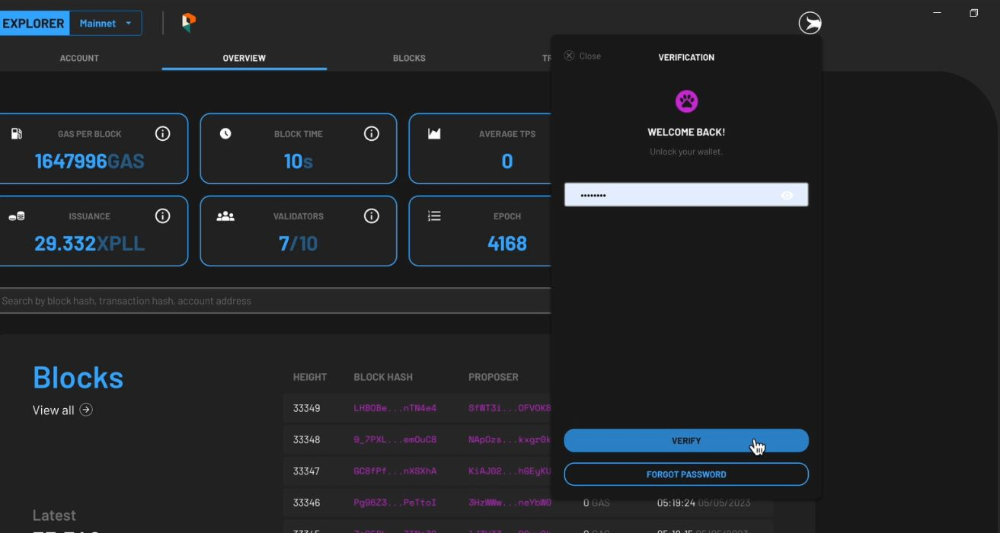
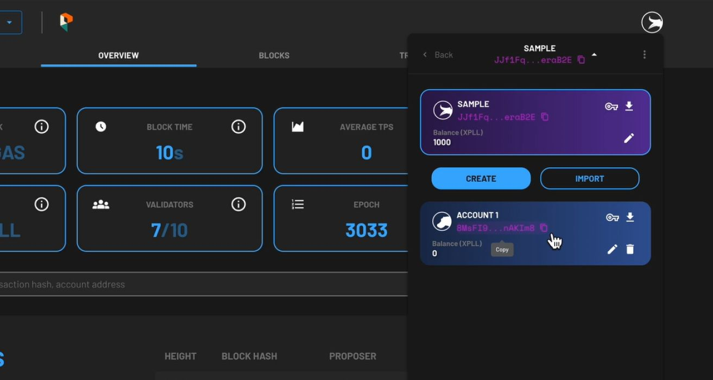
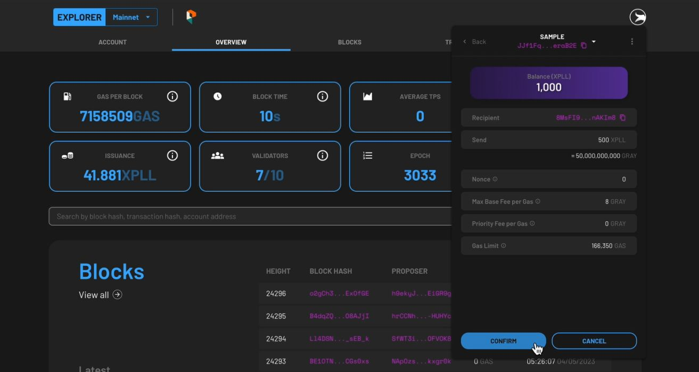

---
tags:
- Xperience
- explorer
- xpll
---

Sending and receiving assets with digital wallets is a keystone of any blockchain's decentralised infrastructure. Follow the steps below to send and receive XPLL tokens with your ParallelChain account. You can also watch the video tutorials to send XPLL tokens [here](https://youtu.be/WvJhzw3fYKo).

## Sending XPLL Tokens
---

### Step 1: Log Into Your Wallet
{ width=80%  style="display: block; margin: 0 auto" } 

1. Access the blockchain explorer via explorer.parallelchain.io, or click on the **EXPLORER** button on the [ParallelChain homepage](https://parallelchain.io/).
2. To log in, click on the *round* icon on the top right hand corner of the webpage and enter your password.
3. Press the **VERIFY** button.
4. If you do not remember your password, you can choose to log in with your recovery key. Once you have access to your account, you should set a new password through your wallet settings.
5. Once you are verified, you can access your wallet account.

### Step 2: Send Tokens To Another Address

1. Click the **SEND** button below the display that shows your XPLL balance.

    { width=80%  style="display: block; margin: 0 auto" } 

2. Enter the address that you want to send XPLL tokens to in the **To Address** field. If you are transferring tokens between your own accounts internally, you can copy the address of the receiving account by clicking the **COPY** icon beside its address.
3. Next, go back to the wallet's main interface and press the **SEND** button located beside the **STAKE** button.
4. Paste the receiving address in the **To Address** field, and enter the amount of XPLL tokens you would like to send in the **Send** field. The amount must not be a negative number, and it cannot exceed the amount of tokens you currently have. Press **NEXT** once you have entered the amount.
5. The following fields will appear:
    - **Nonce**: This field will be automatically populated for you.
    - **Max Base Fee per Gas**: This field will be automatically populated for you based on the current Base Fee per Gas of the network.
    - **Priority Fee per Gas**: This determines the priority of your transaction, and the minimum fee is 0 XPLL.
    - **Gas Limit**: This field will be automatically populated for you.
6. Once you are satisfied with the populated fields, press **NEXT** at the bottom.

### Step 3: Confirm Your Transaction Details
{ width=80%  style="display: block; margin: 0 auto" } 

1. Preview the summary of the transaction, then press **CONFIRM** to continue, or **CANCEL** to make edits.
2. The status of the token deposit will be shown as **PENDING**. When it is validated by the network, **SUCCESS** will be shown under its status tab.
3. You may review your transaction details again by selecting the **TRANSACTIONS** tab on the main page of the account, then select the listed transaction.
3. Watch the video tutorial to send XPLL tokens [here](https://youtu.be/WvJhzw3fYKo).

## Receiving XPLL Tokens
---

### Step 1: Share Your Account Address

- To share your account address with others, tap on the **Copy** icon beside your wallet address.
- Send it to the sender through a secure text messaging application.
- The sender should paste your address in the **To Address** field in their ParallelChain wallet.

### Step 2: Receive Your XPLL Tokens

- After the sender has confirmed the transaction, be patient as the transaction is being validated by the network.
- Once the sender's transaction is confirmed, your wallet balance will be automatically updated.

## FAQ
--- 

### I have not received my XPLL tokens. Where can I check the transaction status?
To check the status of your transaction, you can access the [ParallelChain blockchain explorer](https://explorer.parallelchain.io/) and key in your wallet address. It will display the status and amount being sent. If you are the transaction initiator, you can refer to the status on your wallet's **ACTIVITY** tab.

### Can I cancel or refund transactions?
No, once a transaction request has been made, it cannot be cancelled.